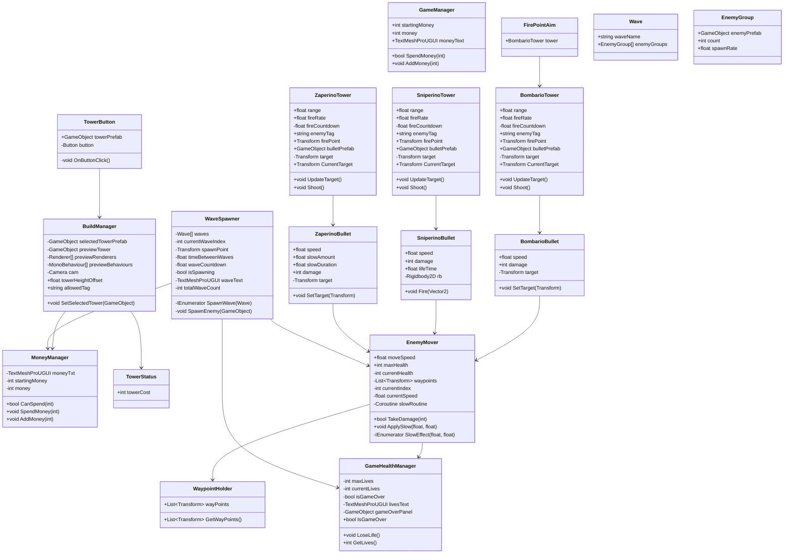

# GD-JAAR2-PROG

# M5

Functions, Methods, Parameters & return type.

PROG les 1: Herhaling Functions, Classes en Arrays.

SCRIPT: https://github.com/Luxin079/kevin-en-mads-avontuurtje/blob/main/Assets/PROG%20SCRIPTS/balletje.cs 

PROG les 2: Action Events

SCRIPT: https://github.com/Luxin079/kevin-en-mads-avontuurtje/blob/main/Assets/PROG%20SCRIPTS/cylinder.cs

PROG Les 3:

SCRIPT: https://github.com/Luxin079/kevin-en-mads-avontuurtje/blob/main/Assets/PROG%20SCRIPTS/EnemySpawner.cs

# M6

Opdracht 1

Code Conventies in Unity

Opdracht 2

Opdaracht Class Diagrams

